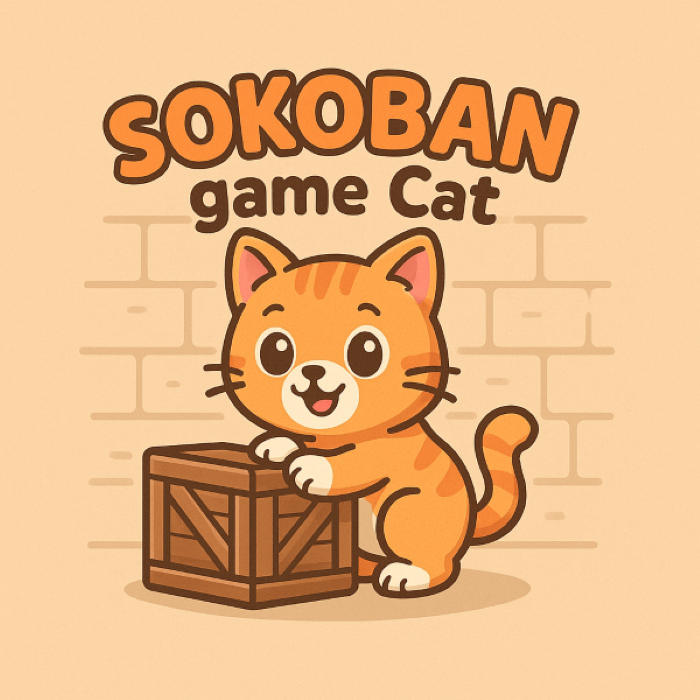

# Ứng dụng thuật toán tìm kiếm trong giải game Sokoban

## Lý thuyết

### Cơ sơ lý thuyết của Môi trường Quan sát Một phần (Partially Observable Environments)

Sự phát triển nhanh chóng của công nghệ và trí tuệ nhân tạo (AI) đã mở ra nhiều cơ hội để nghiên cứu các bài toán giải đố như Sokoban, đặc biệt trong lĩnh vực thuật toán tìm kiếm. Sokoban là một trò chơi logic cổ điển, trong đó người chơi (P) có nhiệm vụ đẩy các thùng (@) đến vị trí đích (1) trên một bản đồ dạng lưới có tường (#), tuân theo các ràng buộc: chỉ được đẩy thùng (không kéo), mỗi ô chỉ chứa tối đa một thùng hoặc người chơi, và thùng không thể được đẩy vào tường hoặc ô đã có thùng khác. Mặc dù luật chơi đơn giản, Sokoban lại sở hữu không gian trạng thái rất phức tạp, tạo nên một thử thách lý tưởng để tìm kiếm đường đi tối ưu dựa trên thiết kế bản đồ, kích thước và số lượng thùng. Quá trình nghiên cứu được tiến hành theo từng giai đoạn với độ phức tạp tăng dần, phù hợp cho nhiều cấp độ hiểu biết và kỹ năng. Hơn nữa, Sokoban còn mang lại giá trị ứng dụng thực tế, chẳng hạn như hỗ trợ lập kế hoạch di chuyển cho robot hoặc tìm đường trong các mạng lưới giao thông phức tạp, đặc biệt trong những tình huống có không gian trạng thái lớn và nhiều chướng ngại vật

### 1. Bài toán Sokoban

Sokoban là một trò chơi giải đố logic, được Hiroyuki Imabayashi phát triển vào năm 1982 tại Nhật Bản. Trong trò chơi, người chơi điều khiển một nhân vật (P) để đẩy các thùng hàng (@) đến các vị trí đích (1) trên một bản đồ lưới, với các ràng buộc nghiêm ngặt như không thể kéo thùng, không thể đẩy thùng qua tường (#) hoặc thùng khác, và mỗi ô chỉ chứa tối đa một thùng hoặc người chơi. Sokoban được chứng minh là bài toán **NP-Hard**, với không gian trạng thái tăng lũy thừa theo số thùng và kích thước bản đồ, khiến nó trở thành một bài toán lý tưởng để đánh giá hiệu quả của các thuật toán tìm kiếm trong trí tuệ nhân tạo (AI).

#### Đặc điểm bài toán
- **Thành phần**:
  - **Người chơi (P)**: Di chuyển trên lưới (lên, xuống, trái, phải), có thể đẩy thùng.
  - **Thùng (@)**: Có thể được đẩy đến vị trí đích.
  - **Tường (#)**: Chướng ngại vật cố định, không thể vượt qua.
  - **Đích (1)**: Vị trí mục tiêu mà thùng cần được đẩy đến.
  - **Ô trống**: Không gian cho người chơi hoặc thùng di chuyển.
- **Ràng buộc**:
  - Chỉ được đẩy thùng, không kéo.
  - Để đẩy thùng, ô phía sau thùng phải trống hoặc là đích.
  - Không thể đẩy thùng qua tường hoặc thùng khác.
  - **Deadlock**: Trạng thái mà thùng bị kẹt ở góc hoặc vị trí không thể di chuyển đến đích.
- **Mục tiêu**: Đưa tất cả thùng đến vị trí đích trong số bước di chuyển tối thiểu.

#### Không gian trạng thái
Không gian trạng thái của Sokoban bao gồm tất cả các cấu hình có thể có của bản đồ, được xác định bởi vị trí của người chơi và các thùng. Với bản đồ kích thước `m × n` và `k` thùng, số trạng thái tối đa có thể lên đến `(m × n choose k) × (m × n - k)`, nhưng các ràng buộc (tường, deadlock) làm giảm số trạng thái hợp lệ. Mỗi trạng thái được biểu diễn bằng một ma trận 2D, với các hành động là di chuyển người chơi (lên, xuống, trái, phải) hoặc đẩy thùng.

#### Độ phức tạp
Sokoban là **NP-Hard** vì:
- Số trạng thái tăng lũy thừa với số thùng và kích thước bản đồ.
- Việc kiểm tra deadlock (ví dụ: thùng bị kẹt ở góc hoặc giữa các thùng khác) đòi hỏi phân tích phức tạp.
- Tìm giải pháp tối ưu (số bước di chuyển ít nhất) tương đương với bài toán tìm đường ngắn nhất trong đồ thị trạng thái.

### 2. Các thuật toán tìm kiếm

Dự án triển khai sáu thuật toán tìm kiếm để giải bài toán Sokoban, chia thành hai nhóm: tìm kiếm không có thông tin (uninformed) và tìm kiếm có thông tin (informed), cùng với một thuật toán học tăng cường.

#### 2.1. Breadth-First Search (BFS)
- **Mô tả**: BFS là thuật toán tìm kiếm không có thông tin, duyệt tất cả trạng thái theo thứ tự độ sâu tăng dần, sử dụng hàng đợi FIFO.
- **Cơ chế**:
  - Bắt đầu từ trạng thái ban đầu, sinh tất cả trạng thái con (di chuyển người chơi hoặc đẩy thùng).
  - Lưu các trạng thái đã duyệt để tránh lặp lại.
  - Tiếp tục cho đến khi tìm thấy trạng thái đích hoặc hết thời gian.
- **Ưu điểm**: Đảm bảo tìm giải pháp ngắn nhất (về số bước) nếu tồn tại.
- **Nhược điểm**: Tốn bộ nhớ do lưu trữ nhiều trạng thái, đặc biệt khi không gian trạng thái lớn.
- **Công thức**:
  - Độ phức tạp thời gian: `O(b^d)`, với `b` là số nhánh trung bình và `d` là độ sâu giải pháp.
  - Độ phức tạp không gian: `O(b^d)`.

#### 2.2. A* Search
- **Mô tả**: A* là thuật toán tìm kiếm có thông tin, sử dụng hàm chi phí `f(n) = g(n) + h(n)`, trong đó `g(n)` là chi phí từ trạng thái ban đầu đến trạng thái hiện tại, và `h(n)` là heuristic ước lượng chi phí đến đích.
- **Cơ chế**:
  - Sử dụng hàng đợi ưu tiên (min-heap) để chọn trạng thái có `f(n)` nhỏ nhất.
  - Heuristic sử dụng là khoảng cách Manhattan tổng giữa các thùng và vị trí đích gần nhất: `h(n) = Σ|x_i - x_d_i| + |y_i - y_d_i|`.
  - Kiểm tra trạng thái đã duyệt để tránh lặp.
- **Ưu điểm**: Hiệu quả hơn BFS nhờ heuristic, giảm số node cần khám phá.
- **Nhược điểm**: Phụ thuộc vào chất lượng heuristic; heuristic không tối ưu có thể dẫn đến hiệu suất kém.
- **Công thức**:
  - Độ phức tạp thời gian: `O(b^d)`, nhưng giảm đáng kể nếu heuristic tốt.
  - Độ phức tạp không gian: `O(b^d)`.

#### 2.3. Backtracking with Forward Checking (Backtracking FC)
- **Mô tả**: Backtracking FC là thuật toán tìm kiếm theo chiều sâu, kết hợp kiểm tra ràng buộc (Forward Checking) để loại bỏ sớm các nhánh dẫn đến deadlock.
- **Cơ chế**:
  - Dùng đệ quy để khám phá trạng thái, chọn hành động (di chuyển hoặc đẩy) và kiểm tra tính hợp lệ.
  - Forward Checking: Kiểm tra xem trạng thái hiện tại có dẫn đến deadlock (ví dụ: thùng bị kẹt ở góc).
  - Quay lui nếu không tìm thấy giải pháp.
- **Ưu điểm**: Tiết kiệm tài nguyên trên bản đồ đơn giản.
- **Nhược điểm**: Không hiệu quả trên bản đồ phức tạp, dễ timeout do độ sâu lớn.
- **Công thức**:
  - Độ phức tạp thời gian: `O(b^d)`, nhưng Forward Checking giảm số nhánh.
  - Độ phức tạp không gian: `O(d)`.

#### 2.4. Beam Search
- **Mô tả**: Beam Search là biến thể của Greedy Search, giữ lại số lượng trạng thái tốt nhất (beam width) mỗi tầng, đánh giá bằng heuristic.
- **Cơ chế**:
  - Tại mỗi bước, sinh tất cả trạng thái con và chọn top `k` trạng thái (beam width) có giá trị heuristic nhỏ nhất.
  - Sử dụng heuristic khoảng cách Manhattan tương tự A*.
- **Ưu điểm**: Giảm không gian tìm kiếm, nhanh trên bản đồ đơn giản.
- **Nhược điểm**: Có thể bỏ sót giải pháp tối ưu nếu beam width nhỏ.
- **Công thức**:
  - Độ phức tạp thời gian: `O(k · d)`, với `k` là beam width.
  - Độ phức tạp không gian: `O(k)`.

#### 2.5. And-Or Search
- **Mô tả**: And-Or Search chia bài toán thành các node AND (yêu cầu giải quyết tất cả trạng thái con, ví dụ: đẩy tất cả thùng đến đích) và OR (chọn hành động tốt nhất).
- **Cơ chế**:
  - Xây dựng cây tìm kiếm với các node AND (trạng thái cần giải quyết nhiều thùng) và OR (lựa chọn hành động).
  - Ưu tiên trạng thái tiềm năng dựa trên heuristic hoặc chi phí.
- **Ưu điểm**: Linh hoạt, hiệu quả trên mọi bản đồ, đặc biệt khi cần xử lý nhiều mục tiêu.
- **Nhược điểm**: Có thể tốn tài nguyên nếu không gian trạng thái quá lớn.
- **Công thức**:
  - Độ phức tạp thời gian: Phụ thuộc vào cấu trúc cây, thường nhỏ hơn BFS.
  - Độ phức tạp không gian: `O(b^d)`.

#### 2.6. Q-Learning
- **Mô tả**: Q-Learning là thuật toán học tăng cường, xây dựng bảng Q để tối ưu chiến lược qua thử nghiệm và phần thưởng.
- **Cơ chế**:
  - Xác định trạng thái (vị trí người chơi, thùng), hành động (di chuyển, đẩy), và phần thưởng (đạt đích, phạt deadlock).
  - Cập nhật bảng Q theo công thức: `Q(s, a) ← Q(s, a) + α[r + γ max Q(s', a') - Q(s, a)]`, với `α` là learning rate, `γ` là discount factor.
  - Sử dụng chiến lược epsilon-greedy để cân bằng khám phá và khai thác.
- **Ưu điểm**: Không cần mô hình hóa toàn bộ không gian trạng thái, có tiềm năng học từ kinh nghiệm.
- **Nhược điểm**: Thời gian hội tụ chậm, cần tối ưu tham số (`α`, `γ`, `ε`).
- **Công thức**:
  - Độ phức tạp thời gian: Phụ thuộc vào số - **Total Reward**: This is a measure of the total reward or return an agent receives over time, often discounted to prioritize immediate rewards.

#### 2.7. Ứng dụng thực tế
Các thuật toán tìm kiếm trong Sokoban có thể được áp dụng vào:
- **Lập kế hoạch di chuyển robot**: Tối ưu đường đi trong không gian hạn chế (nhà kho, bệnh viện).
- **Logistics**: Sắp xếp hàng hóa trong kho hoặc container.
- **Trò chơi AI**: Phát triển AI cho các trò chơi giải đố phức tạp.
- **Tối ưu hóa lộ trình**: Ứng dụng trong giao thông hoặc mạng lưới.

## Tổng quan

**Ứng dụng thuật toán tìm kiếm trong giải game Sokoban** là một dự án nghiên cứu và phát triển tập trung vào việc áp dụng các thuật toán tìm kiếm trong trí tuệ nhân tạo (AI) để giải bài toán Sokoban – một trò chơi giải đố logic cổ điển được phát triển bởi Hiroyuki Imabayashi vào năm 1982 tại Nhật Bản. Dự án triển khai sáu thuật toán tìm kiếm: **Breadth-First Search (BFS)**, **A* Search**, **Backtracking with Forward Checking (Backtracking FC)**, **Beam Search**, **And-Or Search**, và **Q-Learning**, nhằm tìm kiếm đường đi tối ưu trong không gian trạng thái phức tạp của Sokoban. Hệ thống sử dụng **Python 3.12** và **Pygame 2.6.1** để xây dựng giao diện đồ họa trực quan (GUI), cho phép mô phỏng từng bước di chuyển và so sánh hiệu suất các thuật toán.

**GitHub Repository**: [Trantien2005/Project_AI_07](https://github.com/Trantien2005/Project_AI_07)

## Mục tiêu

Dự án đặt ra các mục tiêu cụ thể để đảm bảo tính toàn diện trong nghiên cứu và triển khai:

1. **Phân tích đặc điểm Sokoban**:
   - Nghiên cứu không gian trạng thái của trò chơi, bao gồm các yếu tố ảnh hưởng như số lượng thùng, vị trí tường, vị trí đích, và các ràng buộc di chuyển.
   - Mô hình hóa Sokoban dưới dạng bài toán tìm kiếm trong không gian trạng thái có ràng buộc.
2. **Triển khai thuật toán tìm kiếm**:
   - Phát triển và tích hợp sáu thuật toán tìm kiếm, mỗi thuật toán có chiến lược và ưu/nhược điểm riêng, để giải bài toán Sokoban.
   - Đảm bảo các thuật toán hoạt động chính xác trên các bản đồ với độ phức tạp tăng dần.
3. **So sánh hiệu suất thuật toán**:
   - Đánh giá các thuật toán dựa trên các tiêu chí: thời gian thực thi, số bước di chuyển (độ sâu giải pháp), số node mở rộng/sinh ra, và khả năng tìm giải pháp tối ưu.
   - Cung cấp phân tích định lượng và định tính để xác định thuật toán hiệu quả nhất.
4. **Xây dựng giao diện trực quan**:
   - Phát triển GUI bằng Pygame để hiển thị quá trình giải bài toán từng bước.
   - Hỗ trợ các tính năng như chọn bản đồ, chọn thuật toán, xem kết quả, và lưu thông tin thống kê.
5. **Ứng dụng thực tế**:
   - Khám phá tiềm năng áp dụng các thuật toán vào các bài toán thực tế, chẳng hạn như lập kế hoạch di chuyển robot hoặc tối ưu hóa logistics trong không gian hạn chế.

## Các thành phần chính

### Giao diện người dùng (GUI)

Giao diện được xây dựng bằng **Pygame**, cung cấp trải nghiệm trực quan với các màn hình:

- **Màn hình khởi động**: Tiêu đề “Sokoban game cat”, nhấn Enter để bắt đầu chọn map.

<p align="center">
  
  <br>
  <em>Màn hình khởi động: Sokoban game cat</em>
</p>

- **Màn hình chọn map**:
  - Hiển thị tiêu đề “Sokoban”, danh sách bản đồ, và thuật toán.
  - Điều khiển: **Space** (đổi thuật toán), **Enter** (chạy), **Esc** (xem kết quả), mũi tên trái/phải (chọn bản đồ).

<p align="center">
  
  <br>
  <em>Giao diện Map</em>
</p>

- **Màn hình tải**:
  - Hiệu ứng thanh tiến trình (3 giây) với thông điệp “Are you ready?”.
  - Hỗ trợ animation GIF (sử dụng Pillow).

<p align="center">
  
  <br>
  <em>Màn hình tải Sokoban</em>
</p>

- **Màn hình chơi**:
  - Cập nhật bản đồ động, hiển thị từng bước di chuyển của người chơi và thùng.
  - Hỗ trợ theo dõi quá trình giải bài toán.

<p align="center">
  
  <br>
  <em>Màn hình giải Sokoban</em>
</p>

- **Màn hình kết thúc**:
  - Hiển thị “YOU WIN!” (màu vàng) nếu thành công, “YOU LOSE!” (màu đỏ) nếu thất bại.
  - Nhấn **Enter** để quay lại màn hình khởi động.

<p align="center">
  
  <br>
  <em>Màn hình kết thúc Sokoban</em>
</p>

### 4. Cấu trúc hệ thống

Hệ thống hoạt động theo ba giai đoạn chính:

1. **Input**: Đọc bản đồ từ file `.txt` (1.txt đến 15.txt), phân tích cú pháp để chuyển thành ma trận 2D.
2. **Xử lý**: Áp dụng thuật toán tìm kiếm để tạo dãy trạng thái từ trạng thái ban đầu đến đích.
3. **Output**: Hiển thị quá trình giải trên GUI, lưu kết quả (thời gian, số bước, node mở rộng/sinh ra) vào file.

## Cài đặt và yêu cầu

### Yêu cầu hệ thống

- **Hệ điều hành**: Windows 11 (hoặc tương thích với Python và Pygame).
- **Phần cứng**:
  - CPU: Intel Core i5 hoặc tương đương.
  - RAM: Tối thiểu 8GB.
- **Phần mềm**:
  - Python 3.12.
  - Pygame 2.6.1.
  - Pillow 10.4.0.
  - Tkinter (có sẵn trong Python).
- **IDE**: Visual Studio Code hoặc Visual Studio 2022 (khuyến nghị).

### Hướng dẫn cài đặt

1. **Cài đặt Python**:
   - Tải và cài đặt Python 3.12 từ [python.org](https://www.python.org/downloads/).
   - Đảm bảo thêm Python vào PATH trong quá trình cài đặt.
2. **Cài đặt thư viện**:
```bash
   pip install pygame==2.6.1
   pip install Pillow==10.4.0
```


---

```bash
git clone https://github.com/Trantien2005/Project_AI_07.git
cd Project_AI_07
python main.py
```

---

## Cấu trúc dự án

```
Project_AI_07/
├── main.py
├── bfs.py, a_star.py, beam.py, and_or_search.py, q_learning.py
├── backtracking_fc.py
├── needed_function.py
├── maps/               # chứa 1.txt → 15.txt
└── results/            # lưu log kết quả
```

---

## Kết quả thử nghiệm

| Thuật toán           | Map 1 (Dễ)     | Map 14 (TB)   | Map 3 (Khó)   |
|----------------------|----------------|---------------|---------------|
| BFS                  | 1.05s, 70 bước | 7.70s, 44 bước       | 36.67s, 57 bước        |
| A*                   | 0.95s, 70 bước      | 2.94s, 44 bước         | 31.25s, 57 bước        |
| Backtracking FC      | 0.08s, 96 bước      | Timeout 30s       | Timeout 30s       |
| Beam Search (w=100)  | 0.18s, 50 bước      | 6.29s, 44 bước         | 0.43s, 57 bước         |
| And-Or Search        | 0.04s, 96 bước      | 0.71s, 62 bước         | 1.43s, 93 bước         |
| Q-Learning           | 200.3s, 188 bước    | Timeout 30s       | Timeout 30s       |

---

##  Phân tích hiệu suất

**And-Or Search:**

Hiệu suất: Nhanh nhất (0.04s–1.43s), tìm giải pháp trên cả ba map, với số node mở rộng thấp (289–11977).

Nhận xét: Ổn định, linh hoạt, phù hợp cho mọi mức độ khó. Là lựa chọn tối ưu.

**Backtracking FC:**

Hiệu suất: Rất nhanh trên Map 1 (0.08s, 348 node), nhưng timeout (30s) trên Map 14 và Map 3, không tìm thấy giải pháp.

Nhận xét: Hiệu quả trên bản đồ dễ, nhưng không ổn định trên bản đồ phức tạp do không gian tìm kiếm lớn.

**A(*) Search:**

Hiệu suất: Nhanh hơn BFS (0.95s–31.25s), giảm số node nhờ heuristic Manhattan, nhưng vẫn chậm trên Map 3.

Nhận xét: Phù hợp cho map dễ đến trung bình, cần heuristic mạnh hơn cho map khó.

**BFS:**

Hiệu suất: Ổn định nhưng chậm (1.05s–36.67s), tốn tài nguyên do khám phá toàn bộ không gian trạng thái.

Nhận xét: Đảm bảo giải pháp ngắn nhất, nhưng không hiệu quả trên map khó.

**Beam Search:**

Hiệu suất: Nhanh (0.18s–6.29s) với beam width 100, nhưng không giải được một số map khó.

Nhận xét: Tiết kiệm tài nguyên, nhưng phụ thuộc vào tham số beam width.

**Q-Learning:**

Hiệu suất: Chậm (200.3s trên Map 1), timeout trên Map 14 và Map 3, số bước cao (188).

Nhận xét: Cần tối ưu tham số (alpha, gamma, epsilon) và tăng thời gian để cải thiện hội tụ.

**So sánh tổng quan**

Hiệu suất cao nhất: And-Or Search dẫn đầu về tốc độ, độ tin cậy, và số bước hợp lý (93–96).

Hiệu suất trung bình: A* và BFS hoạt động tốt trên map dễ/trung bình, nhưng chậm trên map khó.

Hiệu suất thấp: Backtracking FC và Q-Learning gặp hạn chế trên map phức tạp; Beam Search cần điều chỉnh tham số.

---

## Hạn chế

**Beam Search:** Chưa tối ưu beam width, dẫn đến bỏ sót giải pháp trên một số map khó.

**Q-Learning:** Thời gian hội tụ chậm, cần điều chỉnh tham số và tăng số episode hoặc timeout.

**Quản lý tài nguyên:** Hệ thống tốn bộ nhớ, đặc biệt với BFS và A* trên map lớn.

**Thời gian thực thi:** Một số thuật toán (BFS, Q-Learning) có thời gian chạy dài trên map phức tạp.

**Heuristic:** Heuristic hiện tại (khoảng cách Manhattan) chưa tối ưu cho các trường hợp deadlock phức tạp.
## Định hướng phát triển

- Tối ưu hóa thuật toán:

  - Cải thiện heuristic cho A* và Beam Search, kết hợp kiểm tra deadlock.
  - Tối ưu Q-Learning bằng cách điều chỉnh alpha, gamma, epsilon, hoặc áp dụng Deep Reinforcement Learning.
  - Thêm thuật toán như IDA* để xử lý map phức tạp với ít bộ nhớ hơn.
- Quản lý tài nguyên:
  - Giảm node mở rộng không cần thiết, tối ưu cấu trúc dữ liệu (ví dụ: hash table để lưu trạng thái).
  - Tăng hiệu suất bằng cách sử dụng luồng riêng (multithreading) cho giao diện và tính toán.
- Mở rộng tính năng:
  - Hỗ trợ biến thể Sokoban (nhiều người chơi, bản đồ động, thùng đa dạng).
  - Thêm chế độ chơi thủ công để người dùng tự giải và so sánh với thuật toán.
  - Tích hợp giao diện web hoặc ứng dụng di động để tăng khả năng tiếp cận.
- Cải thiện GUI:
  - Thêm tính năng lưu/ghi lại quá trình chơi.
  - Hỗ trợ tùy chỉnh bản đồ (map editor).
  - Cải thiện hiệu ứng đồ họa và âm thanh để tăng trải nghiệm người dùng.

---

## Tài liệu tham khảo

Chatterjee, R. (2020). Fundamental concepts of artificial intelligence and its applications.

Journal of Mathematical Problems, Equations and Statistics. [Mathematical Journal](https://www.mathematicaljournal.com/)

Chowdhary, K. R. (2020). Fundamentals of Artificial Intelligence. Springer. [Fundamentals of Artificial Intelligence.](https://dlib.ptit.edu.vn/handle/HVCNBCVT/2258)

Sokoban. Puzzle Wiki. [Sokoban. Puzzle Wiki](https://en.wikipedia.org/wiki/Sokoban).

Junghanns & Schaeffer (1998). Sokoban: Evaluating standard single-agent search techniques in the presence of deadlock. [Junghanns & Schaeffer (1998)](https://en.wikipedia.org/wiki/Junghanns_%26_Schaeffer_(1998)._Sokoban:_Evaluating_standard_single-agent_search_techniques_in_the_presence_of_deadlockSokoban).

Russell, S. J., & Norvig, P. (2020). Artificial Intelligence: A Modern Approach (4th Ed.). Pearson. [Russell, S. J., & Norvig, P. (2020). Artificial Intelligence: A Modern Approach (4th Ed.)](https://aima.cs.berkeley.edu/).

Virkkala, T. (2004). Solving Sokoban. Master's thesis, University of Turku. [Virkkala, T. (2004). Solving Sokoban. Master's thesis, University of Turku.](https://www.researchgate.net/publication/228569467_Sokoban_Reversed_Solving_Bachelor_Thesis).

Pygame Documentation. [Pygame Documentation](https://www.pygame.org/docs/).

GitHub Repository for Testcases. [GithubNguyenCongSon2402](https://github.com/NguyenCongSon2402/Sokoban).

Fully Observable vs. Partially Observable Environment in AI. GeeksforGeeks. [Fully Observable vs. Partially Observable Environment in AI.](https://www.geeksforgeeks.org/fully-observable-vs-partially-observable-environment-in-ai/).

---

## Tác giả:
 
- Nhóm 07: 

	|   Họ tên sinh viên     |   MSSV   |   Mức độ đóng góp | 
	|----------------------- |----------|-------------------|
	|  Nguyễn Quốc Đạt       | 23133015 |        100%       | 
	|  Trần Thảo Tiến        | 23133076 |        100%       | 
	|  Nguyễn Thị Ngọc Trinh | 23133079 |        100%       | 
